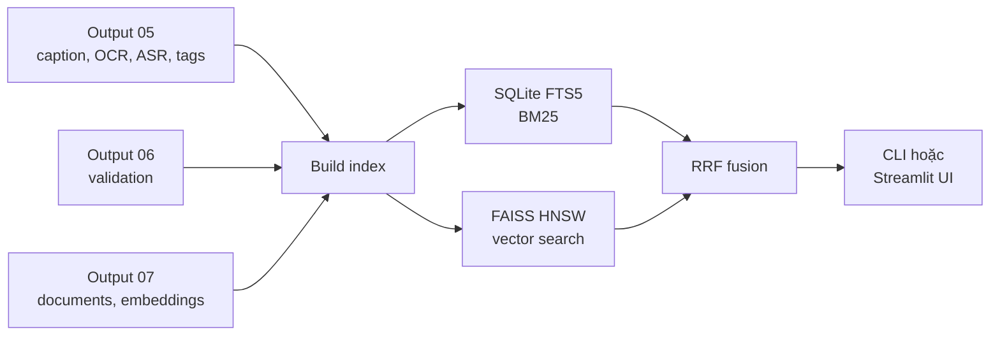

# Hướng dẫn cài đặt và chạy AIC Local Search Engine v2

Tài liệu này dành cho người nhận bàn giao hệ thống tìm kiếm video AIC 2026 và
muốn tự cài, build index, chạy thử hoặc mở giao diện trên máy Windows bằng
VS Code.

## 1. Hệ thống này làm gì?

AIC Local Search Engine v2 là tầng **search local** của pipeline AIC 2026.
Engine không chạy lại scene detection, OCR, ASR hay Qwen. Nó nhận các output đã
xử lý, tạo index một lần, sau đó dùng lại index để tìm kiếm nhiều lần.



Hai nhóm tìm kiếm chính:

- **Tìm kiếm văn bản:** caption, OCR, ASR, tags và event bằng SQLite FTS5/BM25.
- **Tìm kiếm thị giác:** câu mô tả được mã hóa bằng OpenCLIP rồi so sánh với
  vector scene/keyframe trong FAISS.

Kết quả các nhánh được gộp bằng weighted RRF và điều chỉnh theo trạng thái
validation. Hệ thống chạy hoàn toàn local, không cần Elasticsearch, Docker hoặc
dịch vụ nền.

## 2. Những gì cần được bàn giao

Người cài cần có:

1. `aic_local_search_engine_v2.zip`: source code engine phiên bản `0.2.0`.
2. `AIC_local_search_UI.zip`: giao diện Streamlit.
3. Thư mục `component_outputs` chứa dữ liệu đã xử lý.

Cấu trúc khuyến nghị:

```text
C:\AIC2026\
├── aic_local_search\
├── aic_search_ui\
├── component_outputs\
│   ├── 01_keyframes_output.zip
│   ├── 04_scene_clips_output.zip
│   ├── 05_qwen_caption_ocr_whisper_output.zip
│   ├── 06_validation_output.zip
│   └── 07_metadata_output.zip
└── 08_local_search_index_050607\       # được tạo sau khi build
```

Ba output dùng để build search:

| Output | Nội dung | Vai trò |
|---|---|---|
| 05 | caption, OCR/ASR summary, tag, entity, action, event | Tạo các nhánh semantic/tag/event |
| 06 | báo cáo validation | Quality gate và quality penalty |
| 07 | scene/frame documents và embedding | Tạo SQLite và FAISS index |

Output 01 và 04 không bắt buộc nếu chỉ cần trả kết quả dạng text. Nên đặt chúng
trong `component_outputs` để giao diện hiển thị được keyframe và scene clip.

### 2.1. File tối thiểu bên trong output

Engine tìm file theo tên ở mọi cấp thư mục trong ZIP.

Output 05 cần:

```text
scene_semantics_qwen3vl.jsonl
```

Output 06 cần:

```text
component_validation_report.json
```

Output 07 nên dùng schema rich:

```text
scene_docs.jsonl
scene_visual_embeddings.npy
frame_docs.jsonl
frame_visual_embeddings.npy
metadata_manifest.json                 # nên có
```

Engine cũng hỗ trợ schema compact:

```text
scene_metadata.jsonl
scene_embeddings.npy
model_info.json                        # nên có
```

Schema compact chỉ có scene vector. Muốn có `frame_vector` search, cần thêm
output 01 chứa `keyframes.json` và `keyframe_visual_embeddings.npy`, hoặc dùng
schema rich của output 07.

Kiểm tra nhanh tên file trong ZIP bằng PowerShell:

```powershell
tar -tf "C:\AIC2026\component_outputs\05_qwen_caption_ocr_whisper_output.zip"
tar -tf "C:\AIC2026\component_outputs\06_validation_output.zip"
tar -tf "C:\AIC2026\component_outputs\07_metadata_output.zip"
```

## 3. Yêu cầu máy

- Windows 10 hoặc 11.
- Python 3.10 được khuyến nghị; Python 3.11 cũng được hỗ trợ.
- Miniconda hoặc Anaconda.
- VS Code và extension Python.
- RAM 8 GB trở lên cho demo nhỏ; 16 GB thuận tiện hơn.
- GPU không bắt buộc.

BM25, SQLite và FAISS CPU đều chạy được không cần GPU. OpenCLIP cũng có thể chạy
trên CPU, nhưng mã hóa câu truy vấn sẽ chậm hơn.

## 4. Cài môi trường lần đầu

Mở **Anaconda Prompt** hoặc PowerShell đã nhận lệnh `conda`:

```powershell
conda create -n aic-search python=3.10 -y
conda activate aic-search
python -m pip install --upgrade pip
```

Giải nén `aic_local_search_engine_v2.zip` và đổi tên thư mục thành:

```text
C:\AIC2026\aic_local_search
```

Cài engine:

```powershell
cd "C:\AIC2026\aic_local_search"
python -m pip install -e .
```

Cài FAISS CPU:

```powershell
python -m pip install faiss-cpu
```

Kiểm tra:

```powershell
python -c "import aic_local_search, faiss; print('Engine:', aic_local_search.__version__); print('FAISS:', faiss.__version__)"
```

Kết quả bắt buộc:

```text
Engine: 0.2.0
FAISS: <version>
```

Kiểm tra SQLite FTS5:

```powershell
python -c "import sqlite3; c=sqlite3.connect(':memory:'); c.execute('create virtual table t using fts5(x)'); print('FTS5: OK')"
```

### Nếu chưa cần tìm kiếm thị giác

Không cần cài OpenCLIP. BM25 trên caption/OCR/ASR/tags/event vẫn hoạt động đầy
đủ với tùy chọn `--no-vector`.

### Nếu muốn Hybrid BM25 + FAISS

Cài OpenCLIP:

```powershell
python -m pip install open-clip-torch
```

Kiểm tra:

```powershell
python -c "import torch, open_clip; print('OpenCLIP: OK'); print('CUDA:', torch.cuda.is_available()); print('Device:', torch.cuda.get_device_name(0) if torch.cuda.is_available() else 'CPU')"
```

`CUDA: False` không phải lỗi; OpenCLIP sẽ chạy bằng CPU.

> Lưu ý: vector query phải được tạo bằng đúng model đã dùng khi tạo vector ảnh.
> Bộ hiện tại dùng `open_clip:ViT-B-32:openai`, vector 512 chiều. Không được tự
> đổi sang model khác mà vẫn dùng index cũ.

## 5. Build index

Chỉ cần build lần đầu hoặc khi dữ liệu đầu vào thay đổi.

```powershell
conda activate aic-search
cd "C:\AIC2026"
python -m aic_local_search.cli build --input-root "C:\AIC2026\component_outputs" --index-dir "C:\AIC2026\08_local_search_index_050607" --vector-backend faiss
```

Kết quả đúng có dạng:

```text
vector_backend: faiss_hnsw
embedding_dimension: 512
scene_count: > 0
keyframe_count: > 0
video_count: > 0
warnings: []
```

Thư mục index sẽ có:

```text
08_local_search_index_050607\
├── aic_search.db
├── scene_hnsw.faiss
├── frame_hnsw.faiss       # chỉ có khi input chứa frame embeddings
└── index_manifest.json
```

Nếu không cài được FAISS, có thể dùng backend Numpy:

```powershell
python -m aic_local_search.cli build --input-root "C:\AIC2026\component_outputs" --index-dir "C:\AIC2026\08_local_search_index_numpy" --vector-backend numpy
```

Numpy phù hợp để demo nhỏ nhưng chậm và tốn RAM hơn khi dữ liệu lớn.

### Khi dữ liệu đầu vào thay đổi

Không trộn index mới với index cũ. Hãy build sang một thư mục có phiên bản mới,
ví dụ:

```text
08_local_search_index_v2
08_local_search_index_20260723
```

Sau khi kiểm tra index mới chạy đúng, đổi đường dẫn trong UI.

## 6. Kiểm tra index trước khi search

```powershell
python -m aic_local_search.cli inspect --index-dir "C:\AIC2026\08_local_search_index_050607"
```

Kiểm tra các trường:

```text
schema_version: 2
embedding_dimension: 512
stats.validation_passed: true
stats.invalid_scene_count: 0
stats.semantic_scene_count: bằng số scene nếu output 05 hợp lệ
scene_vector_index.backend: faiss_hnsw
frame_vector_index.backend: faiss_hnsw   # nếu có frame embeddings
```

`needs_review_scene_count > 0` vẫn search được; các scene đó bị giảm điểm theo
quality penalty.

Nếu thấy:

```text
Output 05 semantics was not found; semantic/tag/event branches are sparse.
```

thì engine không tìm thấy `scene_semantics_qwen3vl.jsonl` đúng schema trong
output 05. OCR/ASR từ metadata vẫn có thể search, nhưng caption, tags và event
chưa được index đầy đủ. Cần kiểm tra lại tên và schema file output 05 trước khi
đánh giá chất lượng toàn hệ thống.

Nếu `validation_passed: false`, không nên bỏ qua. Hãy sửa lỗi trong output 06
hoặc dữ liệu nguồn rồi build lại.

## 7. Chạy thử bằng command line

### 7.1. Search text bằng BM25

Không cần OpenCLIP:

```powershell
python -m aic_local_search.cli query --index-dir "C:\AIC2026\08_local_search_index_050607" --text "Công viên địa chất Lạng Sơn được UNESCO công nhận" --task scene --no-vector --top-k 5
```

Ví dụ OCR/frame search:

```powershell
python -m aic_local_search.cli query --index-dir "C:\AIC2026\08_local_search_index_050607" --text "chữ CỤC THÚ Y dấu vuông trên thân heo" --task frame --no-vector --top-k 5
```

Ví dụ ASR:

```powershell
python -m aic_local_search.cli query --index-dir "C:\AIC2026\08_local_search_index_050607" --text "Bộ Công an vào cuộc vụ thịt heo bẩn" --task scene --no-vector --top-k 5
```

### 7.2. Hybrid BM25 + FAISS

Bỏ `--no-vector` và truyền thêm mô tả hình ảnh:

```powershell
python -m aic_local_search.cli query --index-dir "C:\AIC2026\08_local_search_index_050607" --text "bản tin kiểm tra thịt heo có dấu kiểm dịch" --visual-text "a television news report showing veterinary inspection marks on pork" --task scene --top-k 5
```

Trong kết quả, kiểm tra:

```text
query_plan.vector_status: used
branch_ranks.scene_vector: <rank>
branch_ranks.frame_vector: <rank>       # nếu index có frame vector
```

Lần chạy đầu có thể lâu vì OpenCLIP tải trọng số model. Sau đó model được dùng
lại từ cache.

### 7.3. Tìm chuỗi scene đúng thứ tự

```powershell
python -m aic_local_search.cli sequence --index-dir "C:\AIC2026\08_local_search_index_050607" --step "Cục Thú y nói về thịt heo" --step "Lạng Sơn nhận bằng UNESCO" --no-vector --top-k 5
```

## 8. Cài và chạy giao diện Streamlit trong VS Code

Giải nén `AIC_local_search_UI.zip` thành:

```text
C:\AIC2026\aic_search_ui
```

### 8.1. Mở đúng thư mục

Trong VS Code:

```text
File → Open Folder → C:\AIC2026\aic_search_ui
```

Chọn interpreter:

```text
Ctrl + Shift + P
→ Python: Select Interpreter
→ Python 3.10 (aic-search)
```

### 8.2. Cài UI

Bản đầy đủ, có Hybrid:

```powershell
conda activate aic-search
cd "C:\AIC2026\aic_search_ui"
python -m pip install -r requirements.txt
```

Nếu chỉ muốn BM25 và không muốn cài PyTorch/OpenCLIP:

```powershell
python -m pip install "streamlit>=1.50,<2" "pandas>=2"
```

### 8.3. Chạy UI

```powershell
python -m streamlit run app.py
```

Hoặc nhấn `F5` và chọn:

```text
AIC Search UI
```

Mở trình duyệt tại:

```text
http://localhost:8501
```

Trong thanh bên của UI, nhập:

```text
Index directory:
C:\AIC2026\08_local_search_index_050607

Asset root:
C:\AIC2026\component_outputs
```

`Index directory` là nơi chứa SQLite/FAISS đã build. `Asset root` là nơi chứa
ZIP output 01 và 04 để hiển thị ảnh/clip.

## 9. Quy trình sử dụng hằng ngày

Sau khi đã cài và build index, mỗi lần dùng chỉ cần:

```powershell
conda activate aic-search
cd "C:\AIC2026\aic_search_ui"
python -m streamlit run app.py
```

Không cần build lại index và không cần chạy lại OCR, ASR, Qwen.

## 10. Cách đọc kết quả

| Trường | Ý nghĩa |
|---|---|
| `scene_id` | scene được tìm thấy |
| `rrf_score` | điểm tổng hợp nhiều nhánh; dùng để xếp hạng |
| `branch_ranks.semantic` | thứ hạng ở caption/semantic |
| `branch_ranks.ocr` | thứ hạng theo chữ trong hình |
| `branch_ranks.speech` | thứ hạng theo lời nói ASR |
| `branch_ranks.tags` | thứ hạng theo entity/action/tag |
| `branch_ranks.event` | thứ hạng theo event và timestamp |
| `branch_ranks.scene_vector` | thứ hạng vector scene |
| `branch_ranks.frame_vector` | thứ hạng vector keyframe |
| `quality_status` | `passed`, `needs_review` hoặc `invalid` |
| `query_plan.vector_status` | `used`, `disabled` hoặc lý do bị bỏ qua |

Điểm RRF chỉ có ý nghĩa để so sánh các kết quả trong cùng một truy vấn, không
phải xác suất chính xác.

## 11. Lỗi thường gặp

### `No module named aic_local_search`

Sai môi trường hoặc engine chưa được cài:

```powershell
conda activate aic-search
cd "C:\AIC2026\aic_local_search"
python -m pip install -e .
```

### Engine hiện `0.1.0`

Đang dùng package cũ:

```powershell
cd "C:\AIC2026\aic_local_search"
python -m pip install --upgrade -e .
python -c "import aic_local_search; print(aic_local_search.__version__)"
```

### `No module named faiss`

```powershell
python -m pip install faiss-cpu
```

Hoặc build với `--vector-backend numpy`.

### `vector_status: disabled`

Query đang dùng `--no-vector` hoặc UI đang chọn chế độ BM25. Đây không phải lỗi.

### `vector_status: skipped: ...`

OpenCLIP/PyTorch chưa được cài, model chưa tải được hoặc model không tương thích
với index. Kiểm tra:

```powershell
python -c "import torch, open_clip; print(torch.__version__); print(torch.cuda.is_available())"
```

### UI có kết quả nhưng không hiện ảnh/clip

Search engine vẫn hoạt động; chỉ thiếu media preview. Kiểm tra `Asset root` có:

```text
01_keyframes_output.zip
04_scene_clips_output.zip
```

Không cần giải nén hai ZIP này.

### Build có warning output 05

Kiểm tra output 05 có đúng:

```text
scene_semantics_qwen3vl.jsonl
```

Không kết luận hệ thống đã chạy đủ nhánh semantic chỉ dựa vào việc ZIP 05 có
mặt. Phải kiểm tra `semantic_scene_count` bằng lệnh `inspect`.

### PowerShell báo lỗi do xuống dòng

Chạy lệnh trên một dòng như trong tài liệu. Nếu dùng dấu xuống dòng PowerShell,
dấu backtick phải là ký tự cuối cùng của dòng và không có khoảng trắng phía sau.

## 12. Checklist bàn giao

Người nhận chỉ được xem là cài thành công khi hoàn thành đủ:

- [ ] `Engine: 0.2.0`.
- [ ] FAISS import thành công hoặc đã chủ động chọn Numpy.
- [ ] SQLite FTS5 báo `OK`.
- [ ] Build tạo `index_manifest.json` và `aic_search.db`.
- [ ] `validation_passed: true`.
- [ ] `invalid_scene_count: 0`.
- [ ] Query BM25 trả kết quả hợp lý.
- [ ] Nếu dùng Hybrid: `vector_status: used`.
- [ ] UI mở tại `http://localhost:8501`.
- [ ] UI hiển thị keyframe/clip khi đã cung cấp output 01/04.

## 13. Tóm tắt ba lệnh quan trọng nhất

Build:

```powershell
python -m aic_local_search.cli build --input-root "C:\AIC2026\component_outputs" --index-dir "C:\AIC2026\08_local_search_index_050607" --vector-backend faiss
```

Kiểm tra:

```powershell
python -m aic_local_search.cli inspect --index-dir "C:\AIC2026\08_local_search_index_050607"
```

Chạy UI:

```powershell
cd "C:\AIC2026\aic_search_ui"
python -m streamlit run app.py
```

