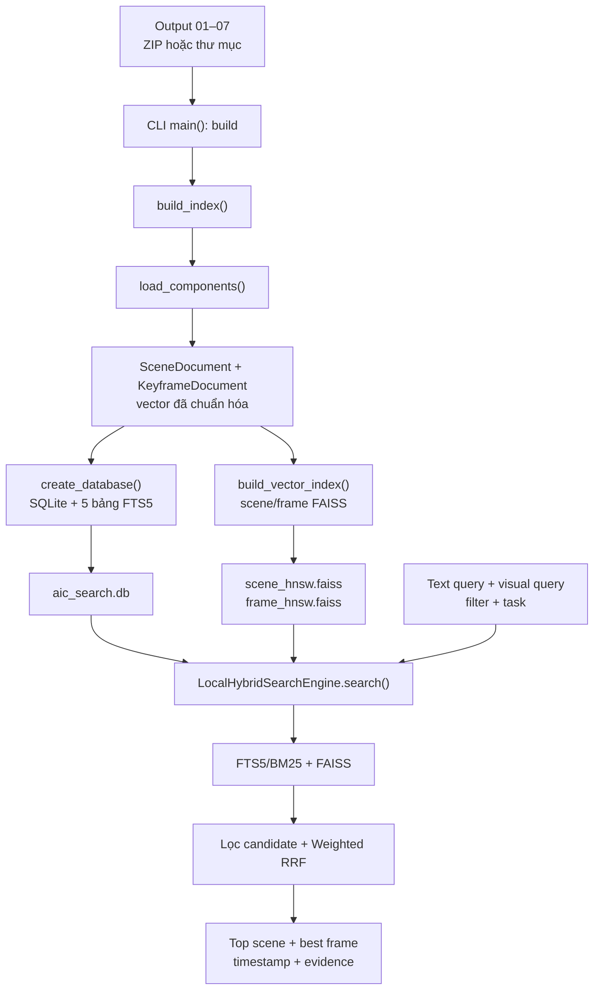

# AIC 2026 Local Search — Luồng dữ liệu và luồng gọi hàm

Tài liệu này mô tả **đúng theo source code `aic-local-search` v0.2.1**:

- mỗi file đầu vào được đọc bởi hàm nào;
- dữ liệu được chuẩn hóa và ghép theo `scene_id` ra sao;
- quá trình `build` tạo SQLite FTS5 và FAISS như thế nào;
- một query từ CLI hoặc giao diện Streamlit đi qua những hàm nào;
- BM25, vector search, lọc candidate, RRF và temporal search xử lý ra sao;
- phần nào đã chạy thật và phần nào mới là kiến trúc dự kiến.

> Phạm vi: tài liệu giải thích module search local hiện tại. Engine không chạy
> lại TransNetV2, OCR, Whisper hoặc Qwen khi người dùng search.

## 1. Tóm tắt kiến trúc

Hệ thống có hai pha độc lập:

1. **Offline build/indexing**: đọc các output của pipeline, ghép thành tài liệu
   theo scene, rồi tạo index tìm kiếm.
2. **Online retrieval**: nhận query, tìm song song trên các index đã tạo, gộp
   thứ hạng và trả kết quả.



Điểm quan trọng:

- Các ZIP **không được mở lại ở mỗi lần search**.
- Online search chỉ đọc `index_manifest.json`, `aic_search.db` và vector index.
- Kết quả cuối vẫn được xếp hạng theo **scene**. Nhánh frame chỉ giúp chọn
  keyframe tốt nhất cho scene.

## 2. Các entry point

| Cách gọi | Entry point | Hàm xử lý tiếp theo |
|---|---|---|
| `aic-local-search build ...` | `cli.main()` | `builder.build_index()` |
| `aic-local-search inspect ...` | `cli.main()` | đọc `index_manifest.json` |
| `aic-local-search query ...` | `cli.main()` | `LocalHybridSearchEngine.search()` |
| `aic-local-search sequence ...` | `cli.main()` | `LocalHybridSearchEngine.search_sequence()` |
| Nút **Tìm kiếm** trên UI | `app.run_search()` | `LocalHybridSearchEngine.search()` |
| Tab **Chuỗi sự kiện** trên UI | code trong `app.py` | `LocalHybridSearchEngine.search_sequence()` |
| Python API | code của người dùng | `build_index()`, `search()` hoặc `search_sequence()` |

Các module chính:

| Module | Trách nhiệm |
|---|---|
| `cli.py` | Đọc tham số dòng lệnh và gọi API tương ứng |
| `builder.py` | Điều phối toàn bộ quá trình build index |
| `ingest.py` | Tìm file, giải nén, đọc, kiểm tra và ghép component |
| `records.py` | Khai báo `SceneDocument`, `KeyframeDocument`, `LoadedComponents` |
| `storage.py` | Tạo SQLite, FTS5, chạy BM25 và đọc metadata |
| `vector_index.py` | Chuẩn hóa vector, tạo/đọc FAISS, encode visual query |
| `planner.py` | Phân loại hint bằng luật và điều chỉnh trọng số nhánh |
| `fusion.py` | Gộp thứ hạng bằng weighted RRF |
| `engine.py` | Điều phối online search và temporal search |
| `config.py` | Khai báo toàn bộ tham số build/search |
| `utils.py` | Đọc JSONL, tách term, accent-fold, tạo truy vấn FTS5 |

## 3. Input nào đi qua hàm nào?

Tất cả input được liên kết bằng:

```text
scene_id = <video_id>_S####
```

Ví dụ:

```text
K16_V001_S0005
```

Keyframe được liên kết thêm bằng `keyframe_id`, ví dụ:

```text
K16_V001_S0005_F000512
```

### 3.1. Bảng ánh xạ input → hàm → dữ liệu trung gian

| Output / file | Hàm đọc trực tiếp | Xử lý | Kết quả trung gian |
|---|---|---|---|
| `01/keyframe_index.csv` | `_load_keyframes()` | Đọc `embedding_row`, `keyframe_id`, `scene_id`, frame, thời gian, đường dẫn ảnh | Danh sách `KeyframeDocument` |
| `01/keyframe_visual_embeddings.npy` | `_load_keyframes()` | Kiểm tra ma trận 2D, số dòng, chiều vector; lấy vector theo `embedding_row`; L2 normalize | `keyframe_embeddings` |
| `01/keyframes.json` | `_load_keyframes()` | Bổ sung quality và metadata cho keyframe | `quality_score`, `metadata` |
| `02/ocr_keyframes.jsonl` | `_load_scene_text(..., key_field="keyframe_id")` | Lập map OCR theo `keyframe_id` | `frame.ocr_text` |
| `02/ocr_scenes.jsonl` | `_load_scene_text()` | Lập map OCR đã tổng hợp theo `scene_id` | `SceneDocument.ocr_text` |
| `03/asr_segments.json` hoặc `.jsonl` | `_load_asr_segments()` | Chuẩn hóa segment có timestamp và khử duplicate | Danh sách ASR segment |
| ASR segment + mốc scene | `_align_asr_segments()` | Gán lời nói vào scene theo phần giao thời gian đủ lớn | Transcript đã căn lại theo scene |
| `03/asr_scenes.jsonl` | `_load_scene_text()` | Đọc transcript scene có sẵn | Fallback khi không có ASR segment |
| `04/scene_clip_manifest.json` | `_load_scene_manifests()` | Đọc thời gian, frame biên và `clip_path` | Metadata nền của scene |
| `05/scene_semantics_qwen3vl.jsonl` | `_load_semantics()` | Chuẩn hóa semantic schema | Semantic record theo scene |
| `05/caption_scenes_qwen3vl.jsonl` | `_load_semantics()` | Chuẩn hóa semantic schema | Semantic record theo scene |
| `05/scene_captions_selfhosted.jsonl` | `_load_semantics()` → `_adapt_selfhosted_semantic()` | Chuyển schema self-hosted về schema chung | Caption, object, relation, OCR vùng, keyword |
| `05/scene_text_index_ready_selfhosted.jsonl` | `_load_semantics()` | Gom các dòng keyframe về scene; dùng làm fallback | Semantic record theo scene |
| `06/component_validation_report.json` | `_load_validations()` | Đọc trạng thái toàn pipeline và lỗi theo scene | Global report + validation theo scene |
| `06/validation_report.json` và quality report | `_load_validations()` | Tìm status/warning/error theo scene | Validation theo scene |
| `07/scene_metadata.jsonl` | `_load_metadata()` | Đọc scene, time, clip, OCR/ASR, keyframe và `embedding_row` | Metadata scene compact |
| `07/scene_embeddings.npy` | `_load_metadata()` | Ghép vector scene bằng `embedding_row` | Map `scene_id → vector` |
| Rich metadata `scene_docs.jsonl` | `_load_metadata()` | Đọc rich scene schema | Metadata scene rich |
| Rich metadata `scene_visual_embeddings.npy` | `_load_metadata()` | Đọc vector scene của rich schema | Map `scene_id → vector` |
| Rich metadata `frame_docs.jsonl` | `_load_keyframes()` fallback | Đọc keyframe khi không có output 01 | `KeyframeDocument` |
| Rich metadata `frame_visual_embeddings.npy` | `_load_keyframes()` fallback | Đọc vector frame | `keyframe_embeddings` |

### 3.2. Trường hợp chỉ có Output 01–04

Engine vẫn có thể build bằng đường fallback:

```text
scene_clip_manifest.json
    + keyframe_index.csv
    + keyframe_visual_embeddings.npy
    + OCR
    + ASR
        ↓
load_components()
        ↓
Tạo metadata scene
        ↓
Lấy trung bình vector các keyframe trong scene
        ↓
Scene embedding
```

Cụ thể, khi `_load_metadata()` không tìm thấy Output 07:

1. `load_components()` kiểm tra có `scene_clip_manifest.json`.
2. Lấy các keyframe thuộc từng `scene_id`.
3. Lấy trung bình vector keyframe.
4. L2-normalize vector trung bình thành scene embedding.
5. Chọn keyframe có `quality_score` cao nhất làm representative frame.
6. Ghép OCR và ASR vào scene.

Giới hạn của đường này:

- không có Output 05 thì `caption`, `tags`, `entities`, `actions` và `events`
  sẽ trống hoặc rất thưa;
- không có Output 06 thì engine vẫn build nhưng ghi warning và không có quality
  validation đầy đủ.

### 3.3. Trường hợp có Output 07

Đây là đường ưu tiên:

```text
scene_metadata.jsonl + scene_embeddings.npy
                    ↓
              _load_metadata()
                    ↓
        metadata và vector theo scene_id
```

Nếu dùng rich schema:

```text
scene_docs.jsonl + scene_visual_embeddings.npy
frame_docs.jsonl + frame_visual_embeddings.npy
```

thì không cần nạp lại Output 01 chỉ để tạo vector frame.

## 4. Luồng build/indexing chi tiết

### 4.1. Call graph

```text
cli.main()
└── build_index(input_root, index_dir, EngineConfig)
    ├── EngineConfig.validate()
    ├── load_components()
    │   ├── _prepare_roots()
    │   │   ├── tìm các file *.zip
    │   │   └── safe_extract_zip()
    │   ├── _load_keyframes()
    │   ├── _load_scene_text("ocr_keyframes.jsonl")
    │   ├── _load_scene_text("ocr_scenes.jsonl")
    │   ├── _load_scene_text("asr_scenes.jsonl")
    │   ├── _load_asr_segments()
    │   ├── _load_scene_manifests()
    │   ├── _load_metadata()
    │   ├── _load_semantics()
    │   ├── _load_validations()
    │   ├── _align_asr_segments()
    │   ├── _semantic_fields()
    │   └── _quality_state()
    ├── build_vector_index(name="scene")
    ├── build_vector_index(name="frame")   # nếu có frame vector
    ├── create_database()
    ├── ghi index_manifest.json
    └── trả BuildReport
```

### 4.2. Giải nén và tìm file

`_prepare_roots()` thực hiện:

1. kiểm tra `input_root` tồn tại;
2. quét mọi ZIP trong `input_root`;
3. chỉ lấy ZIP có tên file liên quan trong `RELEVANT_NAMES`;
4. gọi `safe_extract_zip()` để chống ZIP path traversal;
5. giải nén vào `_aic_search_input_cache`;
6. trả danh sách root gồm thư mục gốc và các thư mục đã giải nén.

Các loader dùng `_discover(roots, filename)` để tìm đúng file cần đọc.

### 4.3. Kiểm tra tính nhất quán

Trong quá trình ingest:

- `_put_record()` cho phép record trùng hoàn toàn nhưng báo lỗi nếu cùng ID có
  nội dung khác nhau;
- số dòng CSV/JSONL phải khớp số vector;
- `embedding_row` phải nằm trong giới hạn;
- tất cả vector scene/frame phải cùng chiều;
- vector không được chứa `NaN`, infinity hoặc norm bằng 0;
- scene embedding và query embedding phải dùng cùng model và cùng dimension.

### 4.4. Căn ASR vào scene

`_align_asr_segments()` không chép một Whisper segment vào mọi scene mà nó chạm
biên. Với mỗi segment:

```text
overlap = min(segment_end, scene_end)
          - max(segment_start, scene_start)
```

Scene chỉ nhận đoạn ASR khi:

```text
overlap >= min(0.75 giây, max(0.05 giây, 10% độ dài segment))
```

Nếu không scene nào đạt ngưỡng, hàm dùng midpoint của segment làm fallback.
Việc này ngăn chủ đề ở scene trước bị lan sang scene sau chỉ vì một đoạn đuôi
Whisper rất ngắn.

### 4.5. Chuẩn hóa semantic

`_load_semantics()` gọi `_adapt_selfhosted_semantic()` để quy nhiều schema về
một cấu trúc chung. Sau đó `_semantic_fields()` tách ra:

```text
caption_vi
caption_en
speech_summary
scene_type
visible_text
keywords
entities
actions
attributes
relations
event_text
temporal_events
```

Các trường này không bị nối vào một text duy nhất; chúng được đưa vào các FTS
branch khác nhau.

### 4.6. Quality gate

`_load_validations()` đọc report toàn cục và report theo scene.

- Nếu `component_validation_report.json` có `passed=false`, `load_components()`
  dừng build bằng `ValueError`.
- `_quality_state()` gán:

| Trạng thái | `quality_penalty` | Hành vi mặc định |
|---|---:|---|
| `passed` | `1.00` | Search bình thường |
| `needs_review` | `0.75` | Vẫn search nhưng bị giảm điểm RRF |
| `invalid` | `0.00` | Vẫn có thể nằm trong DB, nhưng bị loại khỏi candidate do `exclude_invalid=True` |

### 4.7. Tạo document trung gian

`load_components()` trả một `LoadedComponents` gồm:

```text
scenes: list[SceneDocument]
keyframes: list[KeyframeDocument]
scene_embeddings: ndarray[N_scene, D]
keyframe_embeddings: ndarray[N_frame, D] hoặc None
scene_embedding_model
keyframe_embedding_model
stats
warnings
```

`SceneDocument.vector_row` và `KeyframeDocument.vector_row` là khóa nối record
trong SQLite với đúng hàng trong vector index.

## 5. Index được tạo ra như thế nào?

### 5.1. SQLite và FTS5

`create_database()` tạo:

| Bảng | Nội dung |
|---|---|
| `scenes` | Toàn bộ metadata và bằng chứng theo scene |
| `keyframes` | Metadata từng keyframe |
| `events` | Event có thứ tự và timestamp |
| `engine_meta` | Model, config, thống kê build |
| `semantic_fts` | `caption_vi`, `caption_en`, `event_text` |
| `ocr_fts` | `ocr_text`, `visible_text` |
| `speech_fts` | `transcript`, `speech_summary` |
| `tags_fts` | `keywords`, `entities`, `actions`, `attributes`, `relations`, `scene_type` |
| `event_fts` | Mô tả Việt/Anh của từng event |

`_fts_text()` lưu cả văn bản gốc và phiên bản bỏ dấu. FTS5 dùng:

```text
unicode61 remove_diacritics 2
```

nhằm hỗ trợ truy vấn tiếng Việt có hoặc không có dấu.

### 5.2. FAISS hoặc NumPy

`build_vector_index()`:

1. gọi `normalize_vectors()` để L2-normalize;
2. nếu FAISS khả dụng, tạo:

```text
faiss.IndexHNSWFlat(
    dimension,
    hnsw_m=32,
    metric=INNER_PRODUCT
)
```

3. đặt `efConstruction=200`, `efSearch=64`;
4. ghi `scene_hnsw.faiss` và, nếu có, `frame_hnsw.faiss`;
5. nếu không dùng FAISS, lưu `.npy` và tìm exact bằng NumPy.

Vì cả query và dữ liệu đều được L2-normalize:

```text
inner product = cosine similarity
```

### 5.3. Cấu trúc thư mục index

```text
08_local_search_index/
├── aic_search.db
├── scene_hnsw.faiss
├── frame_hnsw.faiss        # chỉ có khi có frame embeddings
└── index_manifest.json
```

`index_manifest.json` lưu:

- `schema_version=2`;
- model embedding;
- dimension;
- config;
- thống kê input;
- warning;
- tên file database/vector index.

## 6. Luồng một query thông thường

### 6.1. Từ CLI

```text
cli.main()
├── đọc --text, --visual-text, --task, --top-k, filter
├── nếu có --query-vector-npy thì np.load()
├── LocalHybridSearchEngine(index_dir)
└── engine.search(...)
```

### 6.2. Từ Streamlit UI

```text
Người dùng nhấn "Tìm kiếm"
└── run_search()
    ├── nếu Hybrid và có visual query:
    │   ├── get_text_encoder()
    │   └── OpenClipTextEncoder.encode()
    ├── nếu visual query trống: tắt vector để tránh nhiễu tiếng Việt
    ├── LocalHybridSearchEngine(index_dir)
    └── engine.search(...)
```

UI dùng thêm:

- `load_manifest()` để đọc manifest;
- `load_video_catalog()` để liệt kê video trong SQLite;
- `build_asset_catalog()` để tìm ảnh/video trong thư mục hoặc ZIP;
- `render_search_results()` và `render_hit()` để hiển thị;
- `resolve_asset()` để ánh xạ `image_path`/`clip_path` tới file thật.

### 6.3. Khởi tạo engine

`LocalHybridSearchEngine.__init__()`:

1. đọc `index_manifest.json`;
2. kiểm tra `schema_version == 2`;
3. khôi phục `EngineConfig`;
4. mở `aic_search.db` ở chế độ read-only;
5. nạp `scene_vector_index`;
6. nạp `frame_vector_index` nếu tồn tại;
7. chưa tải OpenCLIP ngay — encoder chỉ được tải khi thật sự cần.

### 6.4. Call graph của `search()`

```text
LocalHybridSearchEngine.search()
├── plan_query()
├── search_branch("semantic")
├── search_branch("ocr")
├── search_branch("speech")
├── search_branch("tags")
├── search_event_branch()
├── encode_visual_query()                   # nếu cần
├── _scene_vector_candidates()              # nếu có vector
├── _frame_vector_candidates()              # nếu có vector frame
├── fetch_scenes()
├── reciprocal_rank_fusion()
├── representative_frame()                  # nếu frame branch không chọn được
└── tạo danh sách kết quả
```

## 7. Query planner xử lý gì?

`plan_query(text, config, task)` là planner theo luật, chưa phải LLM.

Trọng số nền:

| Branch | Trọng số |
|---|---:|
| `semantic` | 1.35 |
| `ocr` | 1.00 |
| `speech` | 1.00 |
| `tags` | 1.10 |
| `event` | 0.90 |
| `scene_vector` | 1.35 |
| `frame_vector` | 1.00 |

Planner tăng trọng số khi phát hiện hint:

| Query/hình thức task | Thay đổi |
|---|---|
| Có “chữ”, “logo”, “phụ đề”, số dài... | `ocr × 1.8` |
| Có “nói”, “phát biểu”, “nghe”... | `speech × 1.8` |
| Task temporal hoặc có “sau đó”, “trước khi”... | `event × 1.8`, `tags × 1.25` |
| Có từ mô tả hành động | `tags × 1.45`, `event × 1.25` |
| Task `frame` | `frame_vector × 1.5`, `scene_vector × 0.8` |
| Task `scene` hoặc `qa` | `semantic × 1.2`, `scene_vector × 1.2` |

Lưu ý:

- `task="auto"` không tự sinh câu trả lời QA.
- `task="qa"` hiện chỉ thay trọng số retrieval; chưa gọi LLM để tạo answer.
- `split_temporal_query()` có trong `planner.py` nhưng hiện không được gọi trên
  đường chạy chính. Sequence search yêu cầu người dùng truyền từng step rõ ràng.
- `lexical_weight` và `vector_weight` có trong config/manifest nhưng đường chạy
  hiện tại dùng các trọng số từng branch ở bảng trên.

## 8. Các nhánh lexical/BM25

### 8.1. Luồng xử lý

Với bốn nhánh chính:

```text
search_branch()
├── make_fts_query()
│   └── query_terms()
├── _filter_sql()
├── SQLite FTS5 MATCH
├── bm25()
├── snippet()
├── lexical_coverage()
└── trả candidate hợp lệ
```

Riêng event:

```text
search_event_branch()
├── make_fts_query()
├── FTS5 MATCH trên event_fts
├── BM25 từng event
├── lexical_coverage()
├── chỉ giữ event tốt nhất của mỗi scene
└── trả matched_event + timestamp
```

### 8.2. Chuẩn hóa query

`query_terms()`:

1. chuẩn hóa khoảng trắng;
2. bỏ dấu bằng `accent_fold()`;
3. chuyển chữ thường;
4. lấy token chữ/số;
5. bỏ stopword tiếng Việt yếu như `và`, `của`, `vào`, `được`;
6. khử token trùng.

Ví dụ:

```text
Bộ Công an vào cuộc vụ thịt heo bẩn
```

trở thành:

```text
bo, cong, an, cuoc, vu, thit, heo, ban
```

`make_fts_query()` tạo:

```text
"bo" OR "cong" OR "an" OR "cuoc" OR "vu" OR "thit" OR "heo" OR "ban"
```

Khi bật `match_all`:

```text
"bo" AND "cong" AND "an" AND "cuoc" AND "vu" AND "thit" AND "heo" AND "ban"
```

Các toán tử FTS do người dùng gõ trực tiếp bị loại bỏ; chỉ các term đã chuẩn
hóa được đưa vào câu SQL.

### 8.3. BM25 theo từng field

`storage.BRANCHES` cấu hình field boost riêng:

- semantic ưu tiên `caption_vi`, sau đó `caption_en`, `event_text`;
- OCR ưu tiên `ocr_text`, sau đó `visible_text`;
- speech ưu tiên `transcript`, sau đó `speech_summary`;
- tags ưu tiên `keywords`, `entities`, `actions`, rồi các field còn lại.

Raw BM25 được dùng để xếp hạng **bên trong từng branch**. Raw score của BM25
không được cộng trực tiếp với cosine similarity.

### 8.4. Lọc false positive trước RRF

FTS5 mặc định dùng `OR` để lấy candidate rộng. Sau đó `lexical_coverage()` kiểm
tra lại trên đúng bằng chứng của branch.

Mặc định candidate phải thỏa cả hai:

```text
số term khớp >= min(2, số term của query)
coverage >= 0.34
```

Với query tám term ở trên, scene chỉ có từ `công` đạt:

```text
coverage = 1/8 = 0.125
```

nên bị loại trước RRF.

Khi bật `match_all`, `required_coverage = 1.0`.

### 8.5. Metadata filter

`_filter_sql()` có thể lọc:

- `video_id`;
- scene giao với khoảng `start_sec`–`end_sec`;
- scene `invalid`.

## 9. Hai nhánh vector/FAISS

### 9.1. Tạo query vector

Engine có ba đường nhận vector:

1. người dùng truyền `query_vector` trực tiếp;
2. CLI đọc `--query-vector-npy`;
3. `encode_visual_query()` gọi `OpenClipTextEncoder.encode()`.

Visual text phải được encode bằng đúng model đã tạo image embedding, mặc định:

```text
open_clip:ViT-B-32:openai
```

Với config v0.2.1:

```text
require_visual_query_for_vector = True
```

Do đó query tiếng Việt không tự động được gửi sang OpenCLIP khi
`visual_query` trống.

### 9.2. Scene vector

```text
_scene_vector_candidates()
├── VectorIndex.search(query_vector)
├── fetch_scenes_by_vector_rows()
├── bỏ cosine < 0.20
├── áp video/time/quality filter
└── trả scene candidate
```

### 9.3. Frame vector

```text
_frame_vector_candidates()
├── VectorIndex.search(query_vector)
├── fetch_frames_by_vector_rows()
├── fetch_scenes()
├── bỏ cosine < 0.20
├── gom theo scene_id
├── chỉ giữ frame có score cao nhất trong mỗi scene
└── trả scene candidate + best_frame
```

`task="frame"` vẫn trả danh sách scene, nhưng tăng trọng số `frame_vector` và
đính kèm `best_frame`.

## 10. Candidate fusion bằng weighted RRF

Sau khi các branch trả danh sách scene:

```text
branch_results
├── semantic: [S3, S5, S4, ...]
├── ocr: [S5, S4, ...]
├── speech: [S3, S4, ...]
├── tags: [...]
├── event: [...]
├── scene_vector: [...]
└── frame_vector: [...]
```

`engine.search()` chuyển mỗi danh sách thành danh sách `scene_id`, lấy trọng số
từ `plan_query()`, rồi gọi:

```python
reciprocal_rank_fusion(
    ranked_lists,
    rrf_k=60,
    item_multipliers=quality_penalty,
)
```

Điểm của một scene:

```text
RRF(scene)
  = quality_penalty(scene)
    × Σ_branch weight(branch) / (60 + rank_in_branch)
```

Đặc điểm:

- scene xuất hiện trong nhiều branch được cộng nhiều lần;
- RRF dùng thứ hạng, không cộng raw BM25 và cosine;
- scene `needs_review` bị nhân `0.75`;
- `rrf_score` là điểm xếp hạng tương đối, **không phải xác suất đúng**.

Sau RRF, engine lấy `top_k`, rồi bổ sung metadata và evidence.

## 11. Cấu trúc kết quả

Mỗi phần tử kết quả có các nhóm trường:

| Nhóm | Trường tiêu biểu |
|---|---|
| Định danh | `rank`, `scene_id`, `video_id`, `scene_no` |
| Thời gian | `start_sec`, `end_sec` |
| Điểm | `rrf_score`, `branch_scores`, `branch_ranks` |
| Độ phủ | `branch_coverages`, `lexical_coverage`, `matched_terms` |
| Giải thích | `snippets`, `matched_event`, `query_plan` |
| Nội dung | `caption_vi`, `caption_en`, `ocr_text`, `transcript` |
| Semantic | `keywords`, `entities`, `actions` |
| Quality | `quality_status`, `quality_penalty`, `quality_errors` |
| Media | `clip_path`, `best_frame` |

`representative_frame()` được gọi khi frame-vector branch không cung cấp
`best_frame`. Hàm ưu tiên:

1. `representative_keyframe_id`;
2. `quality_score` cao;
3. frame gần giữa scene.

## 12. Ví dụ query đi qua toàn bộ hệ thống

Input:

```text
Text query: Bộ Công an vào cuộc vụ thịt heo bẩn
Task: scene
Visual query: trống
Top K: 5
```

Luồng:

```text
run_search()
├── visual query trống → tắt vector
└── engine.search()
    ├── plan_query(task="scene")
    │   ├── semantic = 1.35 × 1.2 = 1.62
    │   └── scene_vector = 1.35 × 1.2 = 1.62
    ├── query_terms()
    │   └── bo, cong, an, cuoc, vu, thit, heo, ban
    ├── search_branch("semantic")
    ├── search_branch("ocr")
    ├── search_branch("speech")
    ├── search_branch("tags")
    ├── search_event_branch()
    ├── lexical_coverage()
    │   └── loại scene chỉ khớp từ "cong"
    ├── reciprocal_rank_fusion()
    ├── fetch_scenes()
    ├── representative_frame()
    └── Top 5 scene + evidence
```

Nếu người dùng nhập thêm:

```text
Visual query: a television news report about pork inspection
```

thì `OpenClipTextEncoder.encode()` tạo vector và hai nhánh FAISS được thêm vào
RRF.

## 13. Temporal/sequence search

### 13.1. Input

CLI:

```powershell
aic-local-search sequence `
  --index-dir C:\AIC2026\08_local_search_index `
  --step "Cục Thú y nói về thịt heo" `
  --step "Lạng Sơn nhận bằng UNESCO" `
  --top-k 5 `
  --max-gap-sec 120 `
  --no-vector
```

UI nhận mỗi dòng là một step.

### 13.2. Call graph

```text
LocalHybridSearchEngine.search_sequence(steps)
├── với mỗi step:
│   └── search(step, task="temporal", top_k=per_step_k)
├── anchor()
│   ├── dùng absolute_start_sec nếu có matched_event
│   └── nếu không, dùng scene.start_sec
├── khởi tạo beam từ candidate của step 1
├── mở rộng beam qua các step còn lại
├── kiểm tra cùng video
├── kiểm tra đúng thứ tự
├── kiểm tra max_gap_sec
├── tính sequence score
└── trả top sequence
```

Hai candidate được nối khi:

- cùng `video_id`; và
- event sau có `event_order` lớn hơn trong cùng scene, **hoặc**
- `scene_no` của scene sau lớn hơn; và
- khoảng cách không vượt `max_gap_sec`.

Điểm chuỗi:

```text
sequence_score
  = tổng rrf_score của các step
    - 0.0001 × tổng gap
```

Đây là beam search theo thứ tự thời gian, chưa phải model video hiểu chuỗi hành
động end-to-end.

Lưu ý hiện tại:

- Python API hỗ trợ `visual_steps`;
- CLI chưa có tham số `visual_steps`;
- UI temporal chưa thu visual query riêng cho từng step;
- vì `require_visual_query_for_vector=True`, checkbox vector ở tab temporal
  không tạo vector nếu không truyền `visual_steps`. Đường temporal thực tế chủ
  yếu dùng lexical/event search.

## 14. Cơ chế Cascade Rerank thử nghiệm

Cơ chế thử nghiệm trong `cascade_rerank.py` là một engine riêng, **không nằm
trên đường chạy của UI v0.2.1**. Nó chỉ đọc `aic_search.db`, không đọc lại các
ZIP và không dùng FAISS/RRF.

```text
aic_search.db
└── CascadeRerankSearch.from_sqlite()
    ├── đọc semantic, OCR, ASR của từng scene
    └── CascadeRerankSearch.__init__()
        ├── _build_stage1_models()
        │   ├── word TF-IDF unigram/bigram
        │   └── char_wb TF-IDF 3–5 gram
        └── _build_idf()

query
└── CascadeRerankSearch.search()
    ├── normalize_text()
    ├── _query_weights()
    ├── _stage1_scores()
    ├── lấy candidate_k scene
    ├── _expanded_coverage()
    ├── _union_coverage()
    ├── _agreement()
    ├── _bigram_score()
    ├── _passes_gate()
    ├── tính final score × quality_penalty
    └── trả Top K
```

Khác biệt:

| Core engine v0.2.1 | Cascade thử nghiệm |
|---|---|
| SQLite FTS5/BM25 + FAISS | Word/character TF-IDF trong RAM |
| Gộp branch bằng RRF | Candidate rộng rồi rerank bằng evidence |
| Có scene/frame vector | Chỉ semantic/OCR/ASR |
| UI hiện đang dùng | Notebook/lab độc lập |
| Nhanh hơn | Chậm hơn nhưng có relevance gate chặt hơn |

Không nên mô tả Cascade là “reranker đang chạy sau RRF” ở trạng thái hiện tại.
Muốn có pipeline đó cần tích hợp thêm:

```text
engine.search(top_k=50)
→ rerank chính 50 scene này
→ trả top 5–10
```

## 15. Phần đã triển khai và chưa triển khai

| Thành phần | Trạng thái |
|---|---|
| Đọc ZIP/thư mục output | Đã có |
| Adapter Output 05 self-hosted/Qwen | Đã có |
| Validation và quality penalty | Đã có |
| SQLite metadata store | Đã có |
| 5 FTS5/BM25 branch | Đã có |
| Scene FAISS | Đã có |
| Frame FAISS | Có khi input chứa frame embeddings |
| Planner theo luật | Đã có |
| Lọc coverage chống false positive | Đã có từ v0.2.1 |
| Weighted RRF | Đã có |
| Temporal beam search | Đã có |
| Streamlit UI | Đã có |
| LLM query decomposition tự động | Chưa có |
| Cross-encoder/LLM/VLM rerank trong core UI | Chưa có |
| Sinh answer hoàn chỉnh cho Video QA | Chưa có |
| Search trực tiếp trên video gốc lúc query | Không thực hiện |

## 16. Cách theo dõi và debug một query

### Kiểm tra index

```powershell
aic-local-search inspect `
  --index-dir C:\AIC2026\08_local_search_index
```

Cần kiểm tra:

```text
stats.scene_count
stats.semantic_scene_count
stats.invalid_scene_count
scene_vector_index.count
frame_vector_index.count
scene_embedding_model
embedding_dimension
```

Nếu đã nạp Output 05 đầy đủ:

```text
semantic_scene_count == scene_count
```

### Tách kiểm thử lexical khỏi vector

```powershell
aic-local-search query `
  --index-dir C:\AIC2026\08_local_search_index `
  --text "Bộ Công an vào cuộc vụ thịt heo bẩn" `
  --task scene `
  --top-k 5 `
  --no-vector
```

Đọc các trường:

- `branch_ranks`: scene đến từ branch nào;
- `branch_coverages`: mỗi branch phủ bao nhiêu query;
- `matched_terms`: term nào thực sự khớp;
- `snippets`: đoạn evidence;
- `quality_penalty`: scene có bị phạt không;
- `query_plan.vector_status`: vector đã dùng hay bị bỏ qua.

### Kiểm thử strict lexical

```powershell
aic-local-search query `
  --index-dir C:\AIC2026\08_local_search_index `
  --text "Bộ Công an vụ heo bẩn" `
  --task scene `
  --match-all `
  --no-vector
```

### Kiểm thử vector độc lập

Truyền visual query tiếng Anh:

```powershell
aic-local-search query `
  --index-dir C:\AIC2026\08_local_search_index `
  --text "bản tin kiểm tra thịt heo" `
  --visual-text "a television news report about pork inspection" `
  --task scene `
  --top-k 5
```

## 17. Khi nào phải build lại index?

Cần chạy lại `build` khi:

- thêm video hoặc scene;
- Output 01–07 thay đổi;
- sửa OCR/ASR/caption/tag/event;
- sửa cách căn ASR;
- đổi embedding hoặc model embedding;
- đổi schema index hoặc tham số build FAISS.

Không cần build lại khi:

- chỉ thay câu query;
- thay `top_k`;
- bật/tắt vector;
- thay filter video/thời gian;
- thay `match_all`;
- chỉ mở lại Streamlit UI.

## 18. Luồng ngắn gọn nhất

```text
BUILD:
ZIP/output
→ load_components()
→ SceneDocument/KeyframeDocument
→ create_database() + build_vector_index()
→ aic_search.db + FAISS

SEARCH:
query
→ plan_query()
→ 5 lexical branch + 2 vector branch
→ coverage/similarity/quality filter
→ reciprocal_rank_fusion()
→ scene metadata + best frame + evidence

SEQUENCE:
step queries
→ search() từng step
→ beam search theo video, scene/event order và max gap
→ top ordered sequences
```

