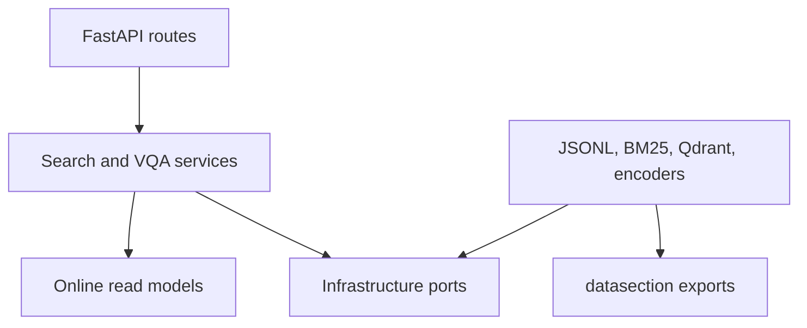
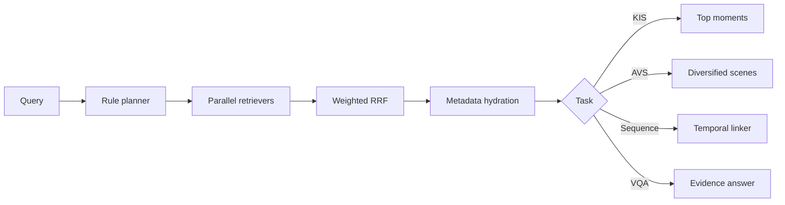

# Online architecture

## Dependency direction

Business services depend on protocols, not Qdrant, files, or FastAPI. Concrete
selection happens only in `api/container.py`.

## Request path

## Read-model boundary

`datasection` owns the canonical `Scene -> Keyframe[]` contract. Online creates
an in-memory `SceneDocument` projection containing only fields needed for
retrieval and display. It is not saved back to the dataset and is therefore not
a second canonical source.

## Why separate retrievers?

- Dense visual: semantic objects, actions, settings.
- Caption BM25: rare explicit terms in generated descriptions.
- OCR BM25: exact on-screen text and names.
- ASR BM25: spoken content.
- Keyword BM25: compact expanded lexical features.

Scores are not directly comparable. Fusion uses rank positions rather than
adding cosine and BM25 values.

## FastAPI lifecycle

The application uses FastAPI lifespan to load metadata and indexes once before
serving traffic, then releases the container on shutdown. Routes obtain the
container through dependency injection. This follows the current FastAPI
recommendation:

- https://fastapi.tiangolo.com/advanced/events/
- https://fastapi.tiangolo.com/tutorial/dependencies/

